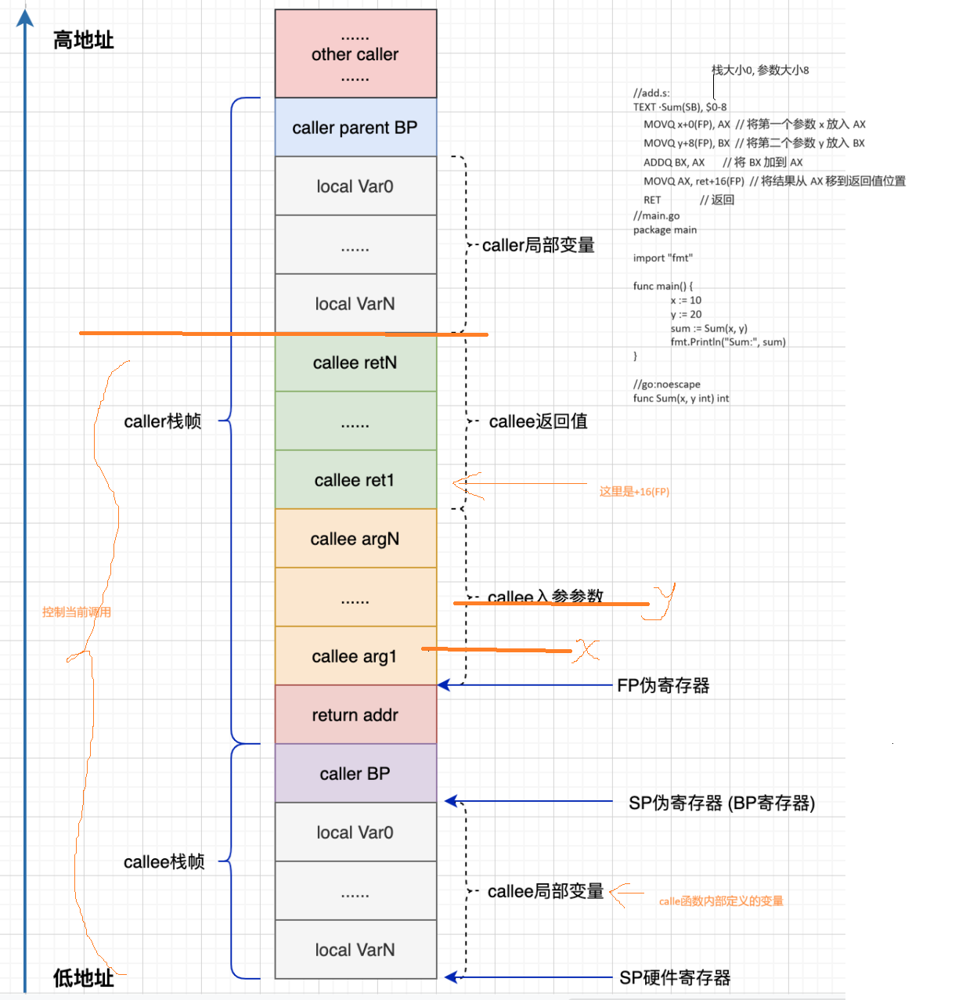

# 2024-06-07,20点25
研究go的源码 看的最新的1.22.4
我会把整个学习过程都写在这个readme.md里面.希望后续可以整理成博客或者书.

##首先是基础知识部分.
#plan 9汇编:


https://plan9.io/sys/doc/comp.pdf

How to Use the Plan 9 C Compiler
                        Rob Pike


# plan9基本知识:
	https://cloud.tencent.com/developer/article/2416368

	go汇编中出现unexpected EOF asm: assembly of pkg\test.s failed的解决办法
	这个bug的解决办法就是在go汇编代码最后换一行就行了


	https://blog.csdn.net/qq_17818281/article/details/114891093


	一套另外的中文教程: 非常好.
	https://golang.design/under-the-hood/zh-cn/part1basic/ch01basic/asm/


	一份很详细的博客:
	https://blog.csdn.net/zhu0902150102/article/details/129539307

  plan9的汇编没什么好的方法来调试.


Go语言汇编:
https://9p.io/sys/doc/asm.html      原始资料的地址.
Plan 9汇编
寄存器：
数据寄存器：R0-R7，地址寄存器：A0-A7，浮点寄存器：F0-F7。
A6指向数据.

伪栈寄存器：FP, SP, TOS。

FP是frame pointer，0(FP)是第一个参数，4(FP)是第二个。

SP是local stack pointer，保存自动变量。0(SP)是第一个。

TOS是top of stack寄存器，用来保存过程的参数，保存局部变量。

汇编器可以有一个变量名，比如p+0(FP)，表示p是第一个参数，这个变量保存在符号表内，但是对程序运行没有影响。实际有用的是 0(FP), 左边那个p只是给程序员看的. 对于计算机没用.但是要求必须写,

例子:下面2个代码都是等效的.都可以直接go run main.go
```
//add.s:
TEXT ·Sum(SB), $0-8
    MOVQ x+0(FP), AX  // 将第一个参数 x 放入 AX
    MOVQ y+8(FP), BX  // 将第二个参数 y 放入 BX
    ADDQ BX, AX       // 将 BX 加到 AX
    MOVQ AX, ret+16(FP)  // 将结果从 AX 移到返回值位置
    RET               // 返回
//main.go
package main

import "fmt"

func main() {
	x := 10
	y := 20
	sum := Sum(x, y)
	fmt.Println("Sum:", sum)
}

//go:noescape
func Sum(x, y int) int


```

```
//add.s:
TEXT ·Sum(SB), $0-8
    MOVQ x11111111111+0(FP), AX  // 将第一个参数 x 放入 AX //注意这里面xy的变量名,随便写.无所谓程序运行.
    MOVQ y222222222222+8(FP), BX  // 将第二个参数 y 放入 BX
    ADDQ BX, AX       // 将 BX 加到 AX
    MOVQ AX, ret+16(FP)  // 将结果从 AX 移到返回值位置
    RET               // 返回
//main.go
package main

import "fmt"

func main() {
	x := 10
	y := 20
	sum := Sum(x, y)
	fmt.Println("Sum:", sum)
}

//go:noescape
func Sum(x, y int) int

```


内存结构图:

通过图很容易看出来ret的地址就是+16(fp)


数据：
所有的外部引用都需通过伪寄存器: PC（virtual Program Counter）/SB（Static Base register）。

PC用来控制程序执行
SB用来引用全局变量。

比如：

把全局数组的地址压栈：MOVL $array(SB), TOS。

把全局数组的第二个元素压栈：MOVL array+4(SB), TOS

local<>+4(SB)是本地变量，只在本文件可见。  <>表示局部变量. 不加<>表示外部变量.


bra: 把目的操作数传递到PC寄存器  bra: branch
    bra.w   $18000        *从10000跳转到18000

bsf bsr:
  格式: BSF dest, src
  影响标志位: ZF
  功能：从源操作数的的最低位向高位搜索，将遇到的第一个“1”所在的位序号存入目标寄存器中，
  若所有位都是0，则ZF=1，否则ZF=0。
  格式: BSR dest, src
  影响标志位: ZF
  功能：从源操作数的的最高位向低位搜索，将遇到的第一个“1”所在的位序号存入目标寄存器中，
  若所有位都是0，则ZF=1，否则ZF=0。

访问全局数据:
  MOVL $a6base(SB), A6      把SB放到A6寄存器里面.


放置数据:
  long word 放置他们的参数,放置适合的大小.
  比如:
    LONG $12345 把12345这个数据(base 10)放置到指令流里面.
  把数据放到data section里面复杂一点.
  指令DATA 接受2个参数, 第一个是放置数据的地址, 第二个是value
  例如:

      DATA  array+0(SB)/1,  $'a'   #$表示数据的意思.   /1表示放入的大小.
      DATA  array+1(SB)/1,  $'b'
      DATA  array+2(SB)/1,  $'c'
      GLOBL array(SB), $4          #4是ascii吗里面的结束符.

  或者 
      DATA  array+0(SB)/4,  $'abc\z'
      GLOBL array(SB), $4  
  解释: 
      GLOBL表示让这个符号array 变成全局变量. $4表示这个变量占用多少byte.


  DYNT INIT允许在Alef编译器上动态的类型.


FP: Frame pointer: arguments and locals.
PC: Program counter: jumps and branches.
SB: Static base pointer: global symbols.
SP: Stack pointer: the highest address within the local stack frame.

   the symbol foo(SB) is the name foo as an address in memory.
   foo(SB)表示SB里面开一个全局变量叫foo
   foo+4(SB) is four bytes past the start of foo.
   foo地址加4表示的地址. 并且这个地址在SB里面.
   Adding <> to the name, as in foo<>(SB), makes the name visible only in the current source file


   x-8(SP), y-4(SP):局部变量用sp, 因为栈是从大到小的. 所以是负号.因为之前x在sp中开变量,他肯定是往小方向走.

   每一个跳跃的label都只在他被定义的函数中才有效.
   所以多个函数中的label可以重名.


    In the general case, the frame size is followed by an argument size, separated by a minus sign. (It's not a subtraction, just idiosyncratic syntax.) The frame size $24-8 states that the function has a 24-byte frame and is called with 8 bytes of argument

    24-8表示栈大小24byte, 参数大小8byte


这是一个完整的函数定义demo:
TEXT runtime·profileloop(SB),NOSPLIT,$8
	MOVQ	$runtime·profileloop1(SB), CX
	MOVQ	CX, 0(SP)
	CALL	runtime·externalthreadhandler(SB)
	RET

 runtime·profileloop 函数名字 栈大小是8, 返回不写.
 把profileloop1函数放到cx里面, 再cx放到sp里面.这样栈里面就放入函数了.之后我们call就表示调用栈里面这个函数.最后ret即可. 这个代码就是调用其他函数.


全局变量赋值的语法:
DATA	symbol+offset(SB)/width, value


DATA divtab<>+0x00(SB)/4, $0xf4f8fcff  # 每4个位置进行一个赋值.
DATA divtab<>+0x04(SB)/4, $0xe6eaedf0
...
DATA divtab<>+0x3c(SB)/4, $0x81828384  
GLOBL divtab<>(SB), RODATA, $64   # 定义和初始化一个read only 变量. 这个变量是全局变量. 长度64

GLOBL runtime·tlsoffset(SB), NOPTR, $4


PCALIGN $32 # 下个命令对齐到32位.对齐好方便硬件加速.
MOVD $2, R0


go跟汇编的常量转化.
For example, given the Go declaration const bufSize = 1024, assembly code can refer to the value of this constant as const_bufSize.


type reader struct {
	buf [bufSize]byte
	r   int
}


Assembly can refer to the size of this struct as reader__size and the offsets of the two fields as reader_buf and reader_r. Hence, if register R1 contains a pointer to a reader, assembly can reference the r field as reader_r(R1).

汇编访问方法:
  reader__size   reader_buf  reader_r  reader_r(R1)


NOPTR 表示这个数据不会配置指针来表示. 他就是直接存数据的.


A good general rule of thumb is to define all non-RODATA symbols in Go instead of in assembly.

非只读数据用go代码来写.


如果函数没有参数和返回值. 写作$n-0.


 src/cmd/internal/obj/arm  这里面写了所有arm的指令集. 他们都以A为前缀.

386 amd在cmd/internal/obj/x86/a.out.go.

指令集都是从左到右的顺序:
  MOVQ $0, CX  表示clears CX


我们看64位的特殊地方:
  get_tls 是一个宏. 用来访问g和m指针.


  get_tls(CX)
  MOVQ	g(CX), AX     // Move g into AX.
  MOVQ	g_m(AX), BX   // Move g.m into BX.

  callee-save 可以长时间的数据
  caller-save 临时数据.


BYTE语法:
Placing data in the instruction stream, say for interrupt vectors, is easy: the
pseudo-instructions LONG and WORD (but not BYTE) lay down the value of their
single argument, of the appropriate size, as if it were an instruction:
    LONG    $12345
places the long 12345 (base 10) in the instruction stream. (On most machines,
the only such operator is WORD and it lays down 32-bit quantities. The 386 has all
three: LONG, WORD, and BYTE.


MOV AX,BX 的二进制编码为:100010   011  000  0000
MOV AH, DL的二进制编码为:100010   110  110  1010
MOV AL, OFh 的二进制编码为:1011000001101111
MOV[BX],AX的二进制编码为:1000100010000000


```


下面我们再重头分析这个代码.
源码中的位置是src\runtime\internal\atomic\atomic_386.s
//这个后面是386.s所以是运行在32位系统的.
```
// uint64 atomicload64(uint64 volatile* addr);
TEXT ·Load64(SB), NOSPLIT, $0-12
	NO_LOCAL_POINTERS
	MOVL	ptr+0(FP), AX  //movb（8位）、movw（16位）、movl（32位）、movq（64位）//因为32位计算机, 指针是32位的所以我们读取变量使用movl
	TESTL	$7, AX
	JZ	2(PC)
	CALL	·panicUnaligned(SB)  //触发未对齐的错误.
	MOVQ	(AX), M0            //AX是表示他的值, (AX)是AX的值作为地址,来取这个地址的值.
	MOVQ	M0, ret+4(FP)  //这行命令需要结合main函数, main函数调用这个load64函数, 然后他先压入参数也就是uint64* addr. 一个8byte的指针, 然后压入load函数调用之后的下行位置.占用4字节. 所以我们代码第一行是0-12. 0表示(load64的)栈空间是0, 12是刚才的8+4. 之后我们算完M0,需要给ret+4的地址赋值. ret是返回位置也就是load函数调用之后的下行位置. 他加4,就是我们的返回值的指针位置即可.
	EMMS   //emms指令是在x86架构中用于清除MMX(多媒体扩展)寄存器状态的指令。
	RET

```


#复习汇编的函数调用:https://kakaroto.homelinux.net/2017/11/introduction-to-reverse-engineering-and-assembly/
int main() {
   return add_a_and_b(2, 3);
}

int add_a_and_b(int a, int b) {
   return a + b;
}


汇编:
_main:
   push   3                ; Push the second argument '3' into the stack
   push   2                ; Push the first argument '2' into the stack
   call   _add_a_and_b     ; Call the _add_a_and_b function. This will put the address of the next
                           ; instruction (add) into the stack, then it will jump into the _add_a_and_b
                           ; function by putting the address of the first instruction in the _add_a_and_b
                           ; label (push %ebx) into the EIP register
   add    %esp, 8          ; Add 8 to the esp, which effectively pops out the two values we just pushed into it
   ret                     ; Return to the parent function.... 

_add_a_and_b:
   push   %ebx             ; We're going to modify %ebx, so we need to push it to the stack
                           ; so we can restore its value when we're done
   mov    %eax, [%esp+8]   ; Move the first argument (8 bytes above the stack pointer) into EAX
   mov    %ebx, [%esp+12]  ; Move the second argument (12 bytes above the stack pointer) into EBX
   add    %eax, %ebx       ; Add EAX and EBX and store the result into EAX
   pop    %ebx             ; Pop EBX to restore its previous value
   ret                     ; Return back into the main. This will pop the value on the stack (which was
                           ; the address of the next instruction in the main function that was pushed into
                           ; the stack when the 'call' instruction was executed) into the EIP register


call xxx: 压入xxx的下一行位置.然后IP进入这个函数.
注意栈是从高到低.所以一个变量的起始坐标是她的下方!!!!!!!!!!!!!!!!!!!!!这点最重要对于栈理解!!!!!!!!!!!!!!!!!!!!!!!!!!
模拟整个过程:
  首先压入3,压入2.然后esp指向2的开始地址.继续续压入call的结束地址,继续压入ebx.
  这时2的开始地址(也就是2的地址小端,注意栈是从大到小生长的)比esp大8.因为中间夹着一个call的结束地址和一个ebx
  2放入eax, 3放入ebx, 然后结果加到eax.之后pop栈最后一个元素给ebx.最后esp加8.等于把栈清空了.
  返回值就是eax. 我理解pop    %ebx 好像没用.一会儿代码试试.也就是这样可以随便pop一下.
  


#我们继续读doc/go_mem.html
一个内存操作关注4个点:
  1.是读还是写,是原子操作,互斥操作,还是channel操作
  2.在程序中的位置
  3.他所访问的内存和变量
  4.操作读还是写的变量
如果p引入库包q, 那么q的初始化函数都在p的初始化之前.
所以所有函数初始化都在main之前.

```
var c = make(chan int, 10)
var a string

func f() {
	a = "hello, world"
	c <- 0
}

func main() {
	go f()
	<-c
	print(a)
}
```
这个代码可以保证打印hello,world, 把10丢掉也是正确的.无论带不带上10: 我们main函数需要c往外吐一个数才能启动, 但是c里面是空,所以f里面c<-0之后,print才启动.


```
var c = make(chan int)
var a string

func f() {
	a = "hello, world"
	<-c
}

func main() {
	go f()
	c <- 0
	print(a)
}
```
可以正确打印.因为c不带缓存,上来就是阻塞的.只有f里面<-c了,main才跑print


```
var c = make(chan int,10)
var a string

func f() {
	a = "hello, world"
	<-c
}

func main() {
	go f()
	c <- 0
	print(a)
}
```
不会打印hello,world.因为我们考虑c带缓存, 那么他就是上来就是非阻塞的.我们main走c<-0时候,f运行不运行都无所谓.所以大概率代码直接打印空就结束了.


var limit = make(chan int, 3)

func main() {
	for _, w := range work {
		go func(w func()) {
			limit <- 1
			w()
			<-limit
		}(w)
	}
	select{}
}
// work是一个任务组成的数组.
//select语句会一直监听所有指定的通道，直到其中一个通道准备好就会执行相应的代码块。
// 这里面一直是空, 所以整个程序阻塞.
//会把work里面的程序都起来, 但是limit大小是3.有3个在运行的w任务时候就会阻塞.这跟信号量效果一样.

锁:
sync里面有 sync.Mutex and sync.RWMutex.


var l sync.Mutex
var a string

func f() {
	a = "hello, world"
	l.Unlock()
}

func main() {
	l.Lock()
	go f()
	l.Lock()
	print(a)
}


Once:
var a string
var once sync.Once

func setup() {
	a = "hello, world"
}

func doprint() {
	once.Do(setup)
	print(a)
}

func twoprint() {
	go doprint()
	go doprint()
}


Atomic Values

Finalizers

Additional Mechanisms
  condition variables, lock-free maps, allocation pools, and wait groups. 

例子:
var a, b int

func f() {
	a = 1
	b = 2
}

func g() {
	print(b)
	print(a)
}

func main() {
	go f()
	g()
}
//it can happen that g prints 2 and then 0.
//main里面print b和a  同时f里面  a=1, b=2 有可能2赋值上了,1还没赋值上.但是我自己测试没复现出来.


var a string
var done bool

func setup() {
	a = "hello, world"
	done = true
}

func doprint() {
	if !done {
		once.Do(setup)
	}
	print(a)
}

func twoprint() {
	go doprint()
	go doprint()
} //没法保证能打印一次.


var a string
var done bool

func setup() {
	a = "hello, world"
	done = true
}

func main() {
	go setup()
	for !done {
	}
	print(a)
}//忙等也没法保证


type T struct {
	msg string
}

var g *T

func setup() {
	t := new(T)
	t.msg = "hello, world"
	g = t
}

func main() {
	go setup()
	for g == nil {
	}
	print(g.msg)
}// 也是错的


Not introducing data races into race-free programs means not moving writes out of conditional statements in which they appear. For example, a compiler must not invert the conditional in this program:
//程序1
*p = 1
if cond {
	*p = 2
}


//程序2
*p = 2
if !cond {
	*p = 1
}

If cond is false and another goroutine is reading *p, then in the original program, the other goroutine can only observe any prior value of *p and 1. In the rewritten program, the other goroutine can observe 2, which was previously impossible.

上面这2个程序不是等效的.
第一个程序我们*p=1, cond=false , 那么另外一个进程读了1
第二个程序我们cond=false, 但是另外一个进程读的快,把之间的2读走了.
所以这两个程序不等效.这就是并发的让问题变复杂了.原则就是不要在cond里面修改并发的变量.


n := 0
for e := list; e != nil; e = e.next {
	n++
}
i := *p
*q = 1
//list死循环, 那么也会在两个进程读写时候发生下面代码i := *p的运行.


*p = i + *p/2
//也不对


n := 0
for i := 0; i < m; i++ {
	n += *shared
}
into:
n := 0
local := *shared
for i := 0; i < m; i++ {
	n += local
}

这两种代码是等价的. 因为其他的读不影响其他的写和读.


# 继续 lib\time文件夹


  update.bash 更新zoneinfo.zip的数据.
  mkzip.go是自己实现的压缩工具.

  ```
	var zb bytes.Buffer
	zw := zip.NewWriter(&zb) //点开这个zip.NewWriter发现他的参数需要一个io.Writer,再点进去发现是一个接口,接口有一个方法Write(p []byte) (n int, err error), byte.Buffer就是一个实现了write方法的类.所以可以传入.//下面就是写入数据即可.
  w, err := zw.CreateRaw(&zip.FileHeader{
  Name:               name,
  Method:             zip.Store,
  CompressedSize64:   uint64(len(data)),
  UncompressedSize64: uint64(len(data)),
  CRC32:              crc32.ChecksumIEEE(data),
})
  if _, err := w.Write(data); err != nil {
    log.Fatal(err)
  }
  ```


# misc\cgo 这里面提供了很多demo代码


fib.go贴到自己的main.go里面. 把big 里面库包改成"math/big"
```go
package main

import (
	"runtime"

	big "math/big"
)

func fibber(c chan *big.Int, out chan string, n int64) {
	// Keep the fibbers in dedicated operating system
	// threads, so that this program tests coordination
	// between pthreads and not just goroutines.
	runtime.LockOSThread() //测试这个在各个os的pthread上的性能.

	i := big.NewInt(n)
	if n == 0 {
		c <- i
	}
	for {
		j := <-c
		out <- j.String() //这里之所以使用string化.是因为big.int直接打印会打印一个对象的地址.不方便观看.转int存不下,只能string化打印是最好的方法.
		i.Add(i, j)   // i=i+j
		c <- i
	}
}

func main() {
	c := make(chan *big.Int)
	out := make(chan string)
	go fibber(c, out, 0) 
	go fibber(c, out, 1)  // 最后参数0,1只是初始值, 线程起来之后, 两个进程就一直死循环了.一直是c里面塞进去一个数, 一个进程读走,之后加上后再塞入. 所以本质还是单进程. 两个进程通过c来同步.效率不会比单进程快.
	for i := 0; i < 200; i++ {
		println(<-out)
	}
}

```


gmp.go 是一个go中嵌入c函数的例子.不好编译,这里就跳过了.
整体思路跟go的bigInt类似.


misc\cgo\gmp\pi.go  使用gmp.go里面的大整数

misc里面其他的都是一些其他平台的支持工具.

## 下面开始源码部分.

src里面从依赖最少得开始看:
	从unicode文件夹开始.文件大体分析会写这里,代码细节我会直接加到相关代码里面的注释.


# src\unicode\utf8\utf8.go

	utf8是unicode一种. 用4个8位来表示. 我理解是我们经常用16进制表示.所以32位=4个16进制.
	对于这个源码我们直接看他提供的接口函数.
	utf8有2个表示一个是byte[] 一个是rune. 

# src\unicode\utf16\utf16.go
	很类似, 这次使用8个8位表示. 如果16进制数,就是4个16进制的数来表示一个unicode编码.


# src\unicode\casetables.go
	定义了一个大小写转化
# src\unicode\graphic.go
	图形的unicode字符串.

# src\unicode\letter.go
	一些字符串的转化函数. 大小写, 在不在一个范围,属性啥的工具函数.

# src\unicode\tables.go
	一些常量的表,作为数据用.不用分析里面的代码逻辑.


# src\unsafe\unsafe.go
	这个库包绕过了go的类型检查,所以不安全.可以直接访问变量的内存和指针.所以很方便.代码中只有函数名和大量的注释.所以这里把注释进行了一些翻译.估计这些函数实现的代码在其他部分.


# strings
	
		可以看到每个文件都配有_test.go, 可以debug里面的测试代码加深理解.
# src\strings\builder.go
		builder是用来创建字符串的.
# src\strings\clone.go
# src\strings\compare.go
# src\strings\reader.go
	 提供了读取字符串数据的各个函数,也都比较简单.
# src\strings\replace.go
	 使用trie树来进行批量的线程安全的字符串替换工具.


# src\strings\search.go
	 bm算法的实现.用于批量的替换字符串.每一次替换很多组字符串对.

# src\strings\strings.go
	 一些字符串基本操作

# strconv
	 字符串的转化
	 # src\strconv\atob.go  ascii到bool的转化
	 # src\strconv\atoc.go  ascii到复数
	 # src\strconv\decimal.go 小数的实现.不建议深入研究,因为这个对于float十进制的不是精确的.实用性不高.
	 # src\strconv\ftoa.go 浮点数到字符串
	 # src\strconv\atof.go 字符串到float
	 # src\strconv\atoi.go 字符串到int
	 # src\strconv\bytealg.go  字符串index函数.
			src\strconv\bytealg.go:13行 引用的是 src\internal\bytealg\indexbyte_native.go:13行
			实际实现在src\internal\bytealg\indexbyte_generic.go
			src\internal\bytealg\indexbyte_generic.go:9 里面写了如何用这个go生成各个平台的汇编代码.
			汇编会涉及一些类型的底层实现:
			type slice struct {//切片
				array unsafe.Pointer
				len int
				cap int
			}
			一个[]byte​ 自然也没有什么特殊的， 也是这样的一个slice​结构， 其中的array​指向一个byte array​。
			type strStruct struct {//string
				str unsafe.Pointer
				len int
			}
			这样我们就可以解释汇编代码了.
			```
TEXT	·IndexByte(SB), NOSPLIT, $0-40
	MOVQ b_base+0(FP), SI   //b_base是一个Pointer所以占用8位
	MOVQ b_len+8(FP), BX   //这里其实是b_len和b_cap两个int,所以占用16位.
	MOVB c+24(FP), AL      //c是int所以占用8位.
	LEAQ ret+32(FP), R8         
	JMP  indexbytebody<>(SB)
			
			```
# src\strconv\isprint.go
	一些编码是否可以打印编码有32位和16位的

# src\strconv\itoa.go
  整数到字符串


# math
		浮点数基本资料:https://blog.csdn.net/weixin_47713503/article/details/108699001
		这里面我们需要记住几个关键数值:在下面一些代码中有用到.
			长浮点数的各个位: 符号位1, 阶码11, 尾数码52, 总位数64, 偏置值3FFH, 十进制偏置值1023

		里面有大量的汇编.文件结构是函数名_平台.s.里面很多函数都涉及数学上的算法.
		我们只需要看amd64或者x86的即可.这俩是pc平台.如果不写平台的就是跨平台的,是必看的.

		
		先看math里面根目录的代码, 他们依赖最少.都是一些数学运算不涉及过多代码设计.
		最底层是

		# src\math\unsafe.go 
		这个代码通过unsafe的指针转化来进行float32 跟bits float64跟bits的互化.

		# src\math\abs.go
		# src\math\acosh.go
		里面有函数避免整数溢出的优化策略

		# src\math\const.go
			一些常数. pi, E啊啥的, 都是多少位的近似值.
		# src\math\atan.go
			利用多项式近似计算.
		# src\math\asin.go
			利用atan来计算.
		# src\math\atan2.go
		  也是利用atan
		# src\math\atanh.go
		  里面也是用了分段函数,来保证计算的最大程度精确.
		# src\math\bits.go
		  是一些特殊数值的定义.无穷,负无穷等和太小的数归一化的方法.
		# src\math\cbrt.go
		  三次开根号算法.牛顿法


		# src\math\dim.go
			一些比较大小函数.
		# src\math\erf.go    src\math\erfinv.go
		  函数erf(x)在数学中为误差函数（也称之为高斯误差函数，error function or Gauss error function），是一个非基本函数（即不是初等函数），其在概率论、统计学以及偏微分方程和半导体物理中都有广泛的应用。是比较高级的函数,涉及一些复杂算法, 这里就不展开了.
		# src\math\exp.go src\math\expm1.go
		  exp函数,底层也是用多项式来近似.
			对于我们amd64平台底层实现是用汇编来加速:(先读懂exp.go的代码,然后再读相关的汇编代码,算法思路都是一样的只是实现的语言不同,并且exp.go里面注释给了算法说明.汇编代码里面没有算法说明.)
			src\math\exp_amd64.s
			使用taylor展开式来近似计算.这个文件的go接口原型在src\math\exp_asm.go


		# src\math\fma.go
		  加速版本的 求x*y+z, 底层思想是用位运算加速, 具体细节比较复杂.
		# src\math\frexp.go
			对一个浮点数进行2的次幂拆分: f == frac × 2**exp,也是用位运算加速.
		# src\math\log.go
			83行看到,如果平台支持,那么就使用汇编来计算log
			根据我们的平台,底层实现是src\math\log_amd64.s

		# src\math\modf.go
			mod拆分一个浮点数为一个整数跟一个分数的和.
		# src\math\nextafter.go
		  返回x到y这个方向的float数的下一个.
		# src\math\pow.go
		  算x的y次幂.使用数学上的换底公式,换成exp和log函数来算.
		# src\math\remainder.go
			x REM y  =  x - [x/y]*y  
		下面是一些二级库包
		# src\math\bits\bits.go
			一些bytes的操作. 加减乘除mod,多少位是1,多少位是0等.
		# src\math\cmplx
			都是一些复数计算, 很少用到.
		# src\math\big\arith.go
			// 1）Little-endian：将低序字节存储在起始地址（低位编址）
			// 2）Big-endian：将高序字节存储在起始地址（高位编址）
			// 记忆: 关注地址的开始地址存什么, 开始存高bit, 就叫大字节序. endian:是end单词加一个后缀表示字节的顺序. 高bit,表示的是大的数. 比如bin(11)里面第一个1表示2, 第二个1表示1.所以就记住了.地址上来就记录大的数就是大endian, 地址上来记录小的数就是小endian.
			// 如果我们将0x1234abcd写入到以0x0000开始的内存中，则结果为；
			// address	big-endian	little-endian
			// 0x0000		0x12				0xcd
			// 0x0001		0x34				0xab
			// 0x0002		0xab				0x34
			// 0x0003		0xcd				0x12


		# src\math\big\nat.go  src\math\big\natconv.go   src\math\big\natdiv.go
			natural numbers 的方法和定义.他是大整数, 大有理数, 大浮点数的底层.
		# src\math\big\int.go 大整数
		# src\math\big\float.go 浮点数 表示为:sign × mantissa × 2**exponent
		# src\math\big\rat.go 分数
		# src\math\big\sqrt.go 算根号. 牛顿法.
			使用sync.Once来保证全局变量的初始化唯一一次.节省内存资源.
		下面的rand库包都是计算分布函数里面的抽样.

		# src\math\rand\rng.go
			是均匀分布的实现.
			理解一下里面的计算流程,至于为什么算法这么设计是对的,需要看相关论文.
		# src\math\rand\rand.go
			伪随机数.
		# src\math\rand\exp.go
			这个是计算指数分布里面的抽样.


